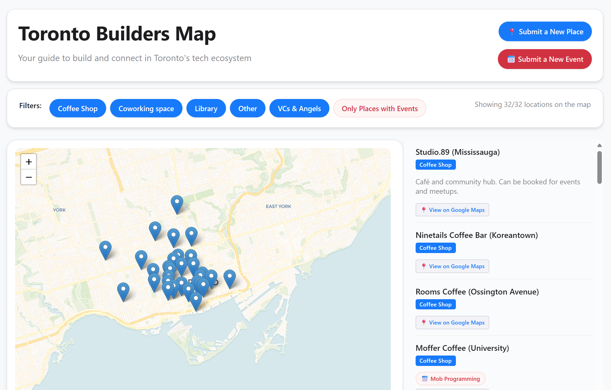

# toronto-builders-map
Map of Toronto for Builders' Needs

- Link to the map: https://toronto-builders-map.onrender.com/
- Link to submit events: https://airtable.com/appFThl6Aw8IKOBif/pagc4ThCUWv4SOF6l/form
- Link to submit places: https://airtable.com/appFThl6Aw8IKOBif/pag8AhtZ5GOZlZ1bJ/form
- Contribute to the repo: https://github.com/users/yasamanparhizkar/projects/2/views/1

## Useful resources:
* Guide to Toronto for Founders: https://startupguidetoronto.notion.site/Starter-Guide-to-Toronto-for-Founders-4fab55bfe1c047b99dfd513863df7d71
* Here's the SF version of the above guide: https://www.startertosf.guide/
* Pampam: https://www.pampam.city
* Founders you should know: https://foundersysk.com
* Shack15: https://www.shack15.com/download

## People to follow on X:
* New systems on X: https://x.com/newsystems_
* Toby Lutke on X: https://x.com/tobi
* Satish Kanwar on X: https://x.com/skanwar
* Beta Kit: https://x.com/BetaKit
* Tron: https://x.com/tron
* internetVin: https://x.com/internetvin

## Code

The app is built using Dash and Leaflet on Python.

### Setup

`pip install -r requirements.txt`

Set the following environment variables in .env

- AIRTABLE_API_KEY
- AIRTABLE_BASE_ID
- AIRTABLE_TABLE_ID (Places table)
- AIRTABLE_EVENTS_TABLE_ID (Events table)

### Repo Structure

- `app.py` contains the main logic of the map, including callbacks, data stores and layout.
- `config`
  - `helpers.py` contains useful functions that handle data parsing and transformation.
  - `schema.py` describes the schema of the data sources in Airtable to avoid repetition in `app.py`.
